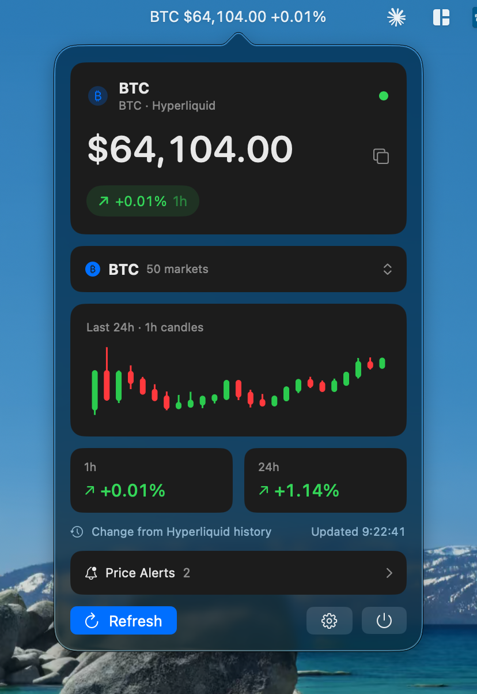
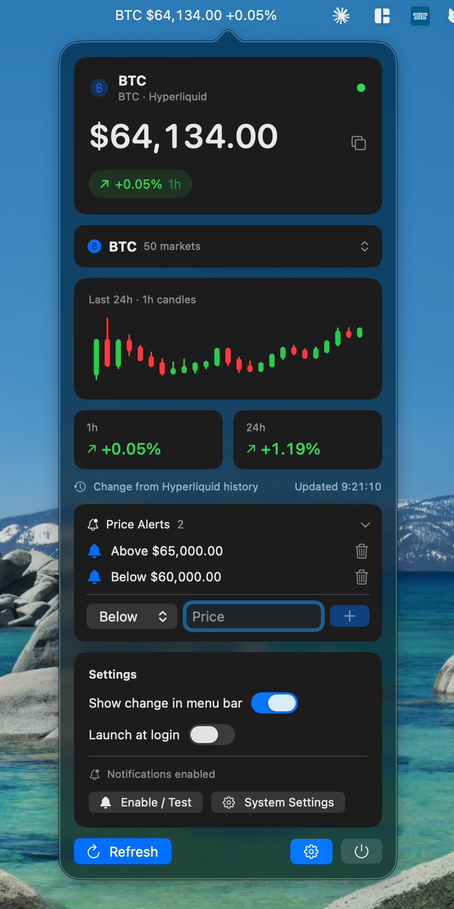
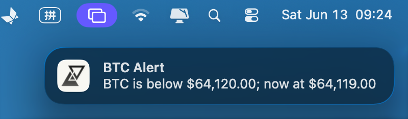

# MiniC

A lightweight macOS menu-bar crypto ticker powered entirely by the **Hyperliquid public feed** — no account, no API key, no tracking. The live price sits in your menu bar; click it for a compact panel with a 24-hour candlestick chart, configurable change windows, and price alerts.

<p align="center">
  
</p>

## Features

- **Live price in the menu bar** — streamed from Hyperliquid's public trade websocket. Optionally append the change % (see Settings).
- **Top 50 markets, searchable** — pick any of the 50 most-active Hyperliquid perps from a dropdown with type-to-filter. (Hyperliquid has no market cap, so markets are ranked by 24-hour trading volume.)
- **Accurate on open** — the 1h / 24h change is computed from a Hyperliquid historical candle snapshot fetched on connect, so the numbers are real immediately instead of starting from zero.
- **Configurable change windows** — each stat tile is tap-to-pick between `15m / 1h / 24h`; your choice is remembered.
- **24-hour candlestick chart** — hourly OHLC (green up / red down), drawn from the same data already fetched for the change calculation, so it costs no extra network.
- **Price alerts** — set above/below thresholds per coin and get a native macOS notification when they trigger.
- **Connection status dot** — green = live, pulsing yellow = connecting / reconnecting, red = can't reach the feed.
- **Resilient & light** — websocket heartbeat with stale-connection detection, instant reconnect on network return or wake-from-sleep, and coalesced UI updates to keep idle CPU low.
- **Launch at login** and native macOS notifications, both opt-in.

| Full panel | Alert notification |
| --- | --- |
|  |  |

## Install

Download the latest **`MiniC.dmg`** from the [**Releases**](../../releases) page, open it, and drag **MiniC** to **Applications**. It runs as a menu-bar item (no Dock icon).

The DMG is built in the cloud by GitHub Actions and attached to each release — nothing is uploaded by hand. It is ad-hoc signed (not notarized), so on first launch you may need to right-click → **Open** to get past Gatekeeper.

## Requirements

- macOS 14 (Sonoma) or later
- Swift 6.1 toolchain / Xcode 16 (only to build from source)

## Build from source

Build a signed `.app` and a `.dmg` locally:

```bash
./scripts/make_app.sh
```

This produces `MiniC.app` and `MiniC.dmg` in the repo root. For a quick debug build during development:

```bash
swift build
```

> Note: launched as a bare binary the app skips notification setup (it needs an app bundle); use the `.app` for the full experience.

## Releasing

Pushing a version tag triggers the GitHub Actions workflow that builds the DMG on a macOS runner and publishes it to a Release:

```bash
git tag v1.2.0
git push origin v1.2.0
```

## How it works

- **Data source:** the public Hyperliquid endpoints only — `wss://api.hyperliquid.xyz/ws` (trades) and `https://api.hyperliquid.xyz/info` (`metaAndAssetCtxs` for the market list, `candleSnapshot` for the historical baseline). No credentials are sent or stored.
- **Change %:** `(current price − close N ago) / close N ago`, where the reference comes from a 24h snapshot of 5-minute candles, refreshed at most every 5 minutes.
- **UI:** SwiftUI + AppKit; the popover self-sizes to its content, the chart uses Swift Charts, and the menu-bar item is fixed-width so it doesn't shift as the price updates.

## Privacy

MiniC talks only to `api.hyperliquid.xyz`. It has no accounts, sends no credentials, and collects no analytics. Your selected coin, chosen change windows, and price alerts are stored locally in `UserDefaults`.

## Tech notes

- `TickerViewModel` orchestrates the stream, candle baseline, market catalog, alerts, and connection state.
- `PriceBaseline` is a small pure type (historical candles → percent change) that's unit-testable in isolation.
- Tests use Apple's swift-testing framework and run under Xcode / `xcodebuild test` (the `Testing` module isn't available with a Command Line Tools–only toolchain).
